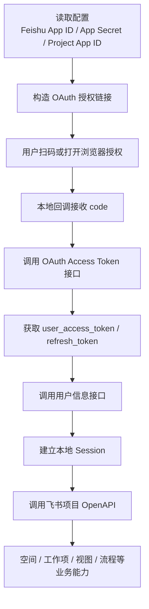
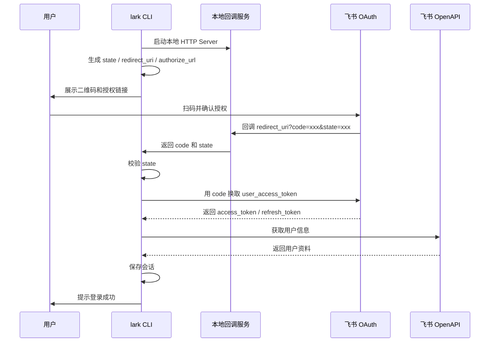
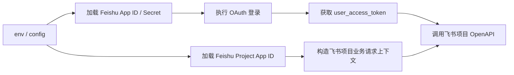
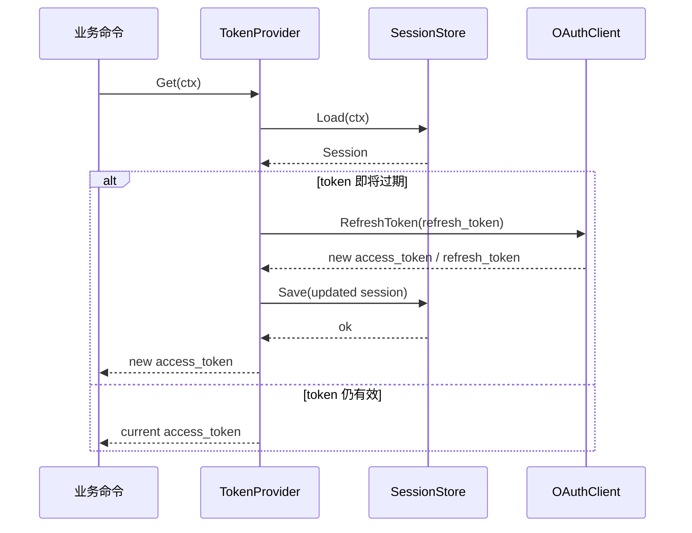
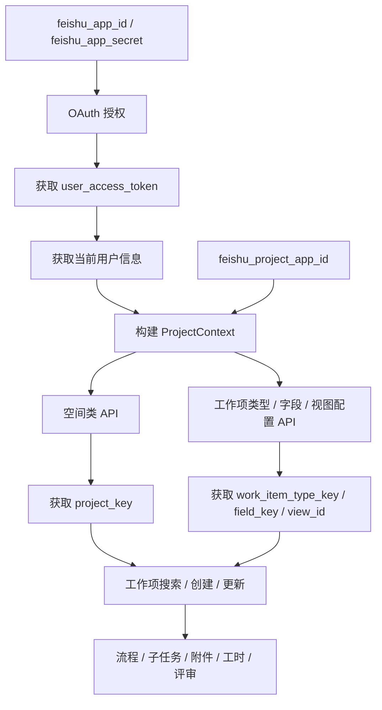

# 登录模块设计

## 1. 文档目标

本文档用于定义 `lark login` 登录模块的设计方案，目标是为 CLI 提供一套稳定、安全、可扩展的飞书登录能力，并为后续调用飞书 OpenAPI 提供用户身份凭证。

本文档重点回答以下问题：
- CLI 如何发起飞书登录。
- 如何在终端中完成扫码/授权体验。
- 如何获取并保存 `user_access_token` / `refresh_token`。
- 如何处理 token 刷新、失效、退出登录与异常场景。
- 如何兼容不同操作系统与终端环境。

---

## 2. Review 结论

基于当前文档内容与 [[飞书项目/飞书项目OpenAPI鉴权流程]]，现有设计思路基本正确，但还存在以下问题需要修正和补齐。

> [!warning] 当前设计中的主要问题
> 1. **认证模型描述不够统一**：文档前半部分强调“扫码二维码登录”，后半部分引用的是标准 OAuth 网页授权示例，两者没有明确衔接。
> 2. **Token 类型边界不清晰**：登录模块核心应围绕 `user_access_token`，而不是应用级 token。当前文档没有明确区分“登录态”与“应用调用态”。
> 3. **结构松散**：依赖、示例代码、错误码、流程说明混排在一起，阅读成本高，不利于后续实现与评审。
> 4. **缺少工程设计内容**：包括模块边界、配置项、会话存储、刷新策略、登出逻辑、安全要求、异常处理、跨平台方案等。
> 5. **实现细节有风险**：示例中大量直接嵌入演示代码，不适合作为 PRD 主体；应抽象为接口、流程、数据结构和约束。
> 6. **跨平台适配章节未完成**：当前文档结尾为空，尚未覆盖 Windows / macOS / Linux 的差异。

> [!success] 建议的文档方向
> 将本文档调整为“**CLI 登录产品设计 + 技术设计概要**”，保留必要示例，但以流程、状态机、数据模型和安全策略为主。

---

## 3. 设计范围

### 3.1 本模块负责

- 提供 `lark login` 命令。
- 在终端展示登录引导信息与授权二维码。
- 启动本地临时回调服务，接收飞书 OAuth 授权回调。
- 用授权码换取 `user_access_token` 与 `refresh_token`。
- 拉取基础用户信息，建立本地登录态。
- 将登录态安全持久化，供其他命令复用。
- 在 token 过期前自动刷新。
- 提供 `lark logout` 退出能力。

### 3.2 本模块不负责

- 应用级 `tenant_access_token` / `plugin_access_token` 的统一管理。
- 业务 API 的权限编排。
- 多账号切换的完整账户中心设计（可作为后续扩展）。

> [!note]
> 根据 [[飞书项目/飞书项目OpenAPI鉴权流程]]，**CLI 登录模块的核心凭证应为 `user_access_token`**。如果后续某些 OpenAPI 需要应用级身份，应由独立的应用鉴权模块负责，不应混入本模块主流程。

---

## 4. 核心方案概述

### 4.1 登录方式

本模块支持两种登录方式：**标准 OAuth 登录** 与 **快捷凭证登录**。

#### 4.1.1 标准 OAuth 登录

采用 **OAuth 2.0 授权码模式（Authorization Code）+ 本地回调** 的方式完成登录。

CLI 启动登录时执行以下动作：
1. 本地启动临时 HTTP Server，监听回调地址，例如 `http://127.0.0.1:8888/callback`。
2. 构造飞书授权链接。
3. 将授权链接同时以以下两种方式呈现给用户：
   - 终端二维码
   - 可点击/可复制的授权 URL
4. 用户使用飞书扫码或在浏览器中打开授权页并确认。
5. 飞书将浏览器重定向到本地回调地址，并附带 `code` 与 `state`。
6. CLI 校验 `state` 后，用 `code` 换取 `user_access_token` / `refresh_token`。
7. CLI 拉取用户信息并写入本地会话文件。

#### 4.1.2 快捷凭证登录

对于不想通过扫码登录或者环境受限的用户，支持使用 `lark login -w user_key xxxx` 的方式直接添加凭证。

CLI 启动登录时执行以下动作：
1. 提示用户：“点击飞书项目左下角的更多信息，复制用户ID（user_key）”。
2. 用户在命令行输入 `lark login -w user_key <用户复制的 user_key>`。
3. CLI 接收到凭证后，验证格式并存入本地会话文件。
4. 后续调用使用该凭证。

### 4.2 为什么采用该方案

- 与飞书标准 OAuth 鉴权流程一致。
- 用户体验较好：扫码直观，适合 CLI 场景。
- 安全性较高：可结合 `state` 做 CSRF 防护。
- 易于扩展：未来可支持浏览器直开、设备码模式或多账号。

---

## 5. 用户体验设计

### 5.1 命令入口

```shell
# 方式一：标准 OAuth 登录
lark login

# 方式二：快捷凭证登录
lark login -w user_key xxxxxxxx
```

### 5.2 标准交互流程

#### 5.2.1 标准 OAuth 登录
```shell
$ lark login

正在初始化登录环境...
√ 本地回调服务已启动: http://127.0.0.1:8888/callback

请使用飞书扫码完成登录：
[终端二维码]

如果二维码无法显示，请在浏览器中打开以下链接：
https://open.feishu.cn/open-apis/oauth/authorize?...

等待授权中...
√ 授权成功
√ 已获取用户信息: 张三 (ou_xxx)
√ 登录态已保存到本地
```

#### 5.2.2 快捷凭证登录
```shell
$ lark login
# （如果用户希望使用快捷登录，可以在提示或帮助中看到）
# 提示：你也可以点击飞书项目左下角的更多信息，复制用户ID，然后执行：
# lark login -w user_key <你的用户ID>

$ lark login -w user_key ou_xxxxxxxxxxxxxx
√ 凭证验证成功
√ 登录态已保存到本地
```

### 5.3 异常交互示例

#### 用户取消授权
```shell
$ lark login
等待授权中...
× 用户取消授权，请重新执行 lark login
```

#### 本地端口被占用
```shell
$ lark login
× 端口 8888 已被占用，正在尝试备用端口 8889...
√ 回调服务已切换至: http://127.0.0.1:8889/callback
```

#### 终端不支持二维码渲染
```shell
$ lark login
! 当前终端不适合渲染二维码，请直接访问以下链接完成授权：
https://open.feishu.cn/open-apis/oauth/authorize?...
```

---

## 6. 鉴权模型设计

### 6.1 凭证类型说明

| 凭证类型                                          | 用途                   | 是否属于登录模块核心 |
| --------------------------------------------- | -------------------- | ---------- |
| `user_access_token`                           | 代表当前登录用户调用飞书 OpenAPI | 是          |
| `refresh_token`                               | 用于刷新用户访问凭证           | 是          |
| `tenant_access_token` / `plugin_access_token` | 代表应用身份调用接口           | 否          |

### 6.2 与参考文档的关系

参考 [[飞书项目/飞书项目OpenAPI鉴权流程]]：
- 登录态建立使用 `user_access_token`。
- 应用级 token 用于服务端应用身份调用，不应替代用户登录态。
- 登录模块完成后，其他需要“用户身份”的命令应优先复用本模块输出的会话信息。

### 6.3 推荐授权参数

建议在授权请求中至少包含：
- `app_id`
- `redirect_uri`
- `state`
- `scope`（按最小权限原则）

如果后续需要长期登录态，则需申请并使用：
- `offline_access`

### 6.4 登录模块涉及的 API 清单

为了让 `lark_cli` 能够真正访问“飞书项目”相关能力，必须先完成登录并获取 `user_access_token`。**没有 `user_access_token`，飞书项目相关用户态操作将无法使用。**

建议将当前登录模块涉及的 API 分为两层：

| 层级 | API | 用途 | 是否登录必需 |
|---|---|---|---|
| OAuth 授权层 | 授权页（authorize URL） | 引导用户扫码/授权，拿到 `code` | 是 |
| OAuth 授权层 | `POST /open-apis/oauth/v3/access_token` | 用授权码换取 `user_access_token` / `refresh_token` | 是 |
| OAuth 授权层 | 刷新 token 接口 | 刷新 `user_access_token` | 是（长期登录时） |
| 用户信息层 | 用户信息接口 | 获取当前登录用户资料，建立本地会话 | 是 |
| 飞书项目业务层 | 飞书项目 OpenAPI（空间、工作项、视图、流程等） | 实际业务能力调用 | 是（依赖前置登录） |

> [!important]
> 对当前 CLI 而言，登录模块并不是一个孤立模块，它是“飞书项目能力”的前置依赖模块。也就是说：
> `lark login` → 获取 `user_access_token` → 建立本地登录态 → 后续飞书项目命令才能继续执行。

### 6.5 登录模块与飞书项目 API 的依赖关系



### 6.6 飞书项目相关 API 分组说明

结合 [[飞书项目/飞书项目OpenAPI依赖关系]]，后续会被登录态直接支撑的飞书项目 API 可以按以下方式理解：

| 分组 | 典型能力 | 依赖前置 |
|---|---|---|
| 空间与基础信息 | 空间列表、空间详情、用户/群组信息 | `user_access_token` |
| 配置能力 | 工作项类型、字段、流程模板、视图配置 | `user_access_token` + `project_key` |
| 工作项核心能力 | 搜索、创建、更新、删除、详情查询 | `user_access_token` + `project_key` + `work_item_type_key` |
| 流程与节点能力 | 获取工作流、节点推进、节点回滚 | `user_access_token` + `work_item_id` |
| 扩展能力 | 子任务、附件、工时、评审、关联工作项 | `user_access_token` + 业务主键 |

---

## 7. 模块架构设计

### 7.1 模块拆分

建议拆分为以下子模块：

| 模块 | 职责 |
|---|---|
| `login/command` | CLI 命令入口与用户交互 |
| `login/oauth` | 授权 URL 构造、code 换 token、refresh token |
| `login/callback` | 本地 HTTP 回调服务管理 |
| `login/qrcode` | 终端二维码渲染与降级处理 |
| `login/session` | 会话持久化、读取、更新、删除 |
| `login/userinfo` | 使用 `user_access_token` 拉取用户资料 |
| `login/state` | `state` 生成与校验 |

### 7.2 依赖建议

| 依赖 | 类型 | 用途 | 备注 |
|---|---|---|---|
| `net/http` | 标准库 | 本地回调服务、调用飞书接口 | 必需 |
| `context` | 标准库 | 控制超时、取消、优雅关闭 | 必需 |
| `encoding/json` | 标准库 | 解析响应 | 必需 |
| `os` / `path/filepath` | 标准库 | 读取配置、会话文件落盘 | 必需 |
| `time` | 标准库 | token 过期判断与刷新 | 必需 |
| `qrterminal` | 第三方 | 在终端渲染二维码 | 推荐 |
| `spinner` | 第三方 | 登录等待态反馈 | 推荐 |
| `color` | 第三方 | 输出高亮/错误提示 | 可选 |

> [!note]
> 当前文档中的依赖列表有编号混乱、安装命令不完整等问题，后续实现文档中应单独维护“开发依赖清单”，避免将 PRD 与环境搭建说明混在一起。

---

## 8. 核心流程设计

### 8.1 时序图



### 8.2 流程分阶段说明

#### 第一阶段：初始化（两种模式通用）
1. 读取本地配置（`app_id`、回调端口、scope 等）。
2. 检查是否已存在有效登录态。
3. 若已登录且 token 有效，可提示用户是否覆盖当前登录态。

#### 第二阶段：获取凭证

**分支 A：标准 OAuth 登录**
1. 选择回调端口并启动本地 HTTP Server。
2. 生成随机 `state`。
3. 生成飞书授权 URL。
4. 将 URL 渲染为二维码并输出到终端。
5. 同时打印备用授权链接。
6. CLI 阻塞等待授权结果。
7. 浏览器访问本地回调地址。
8. 提取 `code`、`state`、`error` 等参数。
9. 若超时未授权，则中止流程并清理本地服务。
10. 校验 `state`，防止伪造请求。
11. 使用 `code` 调用 access token 接口。
12. 解析响应，获取 `user_access_token`、`refresh_token`、过期时间。
13. 若返回错误码，则映射为可理解的 CLI 提示。

**分支 B：快捷凭证登录**
1. 解析命令行参数 `-w user_key`。
2. 校验 `user_key` 的格式（如以 `ou_` 开头）。
3. 提示“正在验证用户凭证...”。

#### 第三阶段：建立登录态
1. （仅分支 A 需要）用 `user_access_token` 请求用户信息。
2. 生成本地 `Session` 对象。（如果是分支 B，则将 `user_key` 保存为 `UserID` 和 `AccessToken` 或专门用于标识身份的字段，并模拟必要的 Session 信息）。
3. 会话写入本地安全存储。
4. （仅分支 A 需要）关闭临时 HTTP Server。
5. 输出登录成功提示。

---

## 9. 数据模型设计

### 9.1 Session 模型

```go
type Session struct {
    AppID                string    `json:"app_id"`
    UserID               string    `json:"user_id"`
    OpenID               string    `json:"open_id,omitempty"`
    Name                 string    `json:"name"`
    Email                string    `json:"email,omitempty"`
    AccessToken          string    `json:"access_token"`
    RefreshToken         string    `json:"refresh_token,omitempty"`
    AccessTokenExpiresAt time.Time `json:"access_token_expires_at"`
    RefreshTokenExpiresAt time.Time `json:"refresh_token_expires_at,omitempty"`
    Scope                string    `json:"scope,omitempty"`
    TokenType            string    `json:"token_type,omitempty"`
    CreatedAt            time.Time `json:"created_at"`
    UpdatedAt            time.Time `json:"updated_at"`
}
```

### 9.2 Token 响应模型

```go
type OAuthTokenResponse struct {
    Code                  int    `json:"code"`
    AccessToken           string `json:"access_token"`
    ExpiresIn             int    `json:"expires_in"`
    RefreshToken          string `json:"refresh_token"`
    RefreshTokenExpiresIn int    `json:"refresh_token_expires_in"`
    Scope                 string `json:"scope"`
    TokenType             string `json:"token_type"`
    Error                 string `json:"error"`
    ErrorDescription      string `json:"error_description"`
}
```

### 9.3 用户信息模型

```go
type UserInfo struct {
    UserID string `json:"user_id"`
    OpenID string `json:"open_id"`
    Name   string `json:"name"`
    Email  string `json:"email,omitempty"`
}
```

### 9.4 临时授权上下文

```go
type LoginContext struct {
    State       string
    RedirectURI string
    ListenPort  int
    StartedAt   time.Time
    Timeout     time.Duration
}
```

---

## 10. 本地会话存储设计

### 10.1 存储目标

需要满足：
- CLI 重新启动后仍能识别登录态。
- 可以判断 token 是否过期。
- 支持刷新 token。
- 支持 `logout` 清理。

### 10.2 存储位置建议

建议按操作系统使用用户目录下的应用配置目录，例如：

| 平台      | 建议路径                                                                       |
| ------- | -------------------------------------------------------------------------- |
| macOS   | `~/.lark/session.json` 或 `~/Library/Application Support/lark/session.json` |
| Linux   | `~/.lark/session.json`                                                     |
| Windows | `%AppData%/lark/session.json`                                              |

### 10.3 存储策略

- 默认保存为本地文件。
- 文件权限尽量收紧。
- 仅保存必要信息，不记录无关响应字段。
- 日志中不得打印完整 token。

> [!warning]
> 会话文件中保存的是高敏感信息。正式实现时建议进一步评估系统密钥链方案，例如 Windows Credential Manager、macOS Keychain、Linux Secret Service。

---

## 11. Token 生命周期设计

### 11.1 基本规则

- `user_access_token` 有有效期，必须依据接口返回值判断，不可写死。
- 若需要长期登录，应保存 `refresh_token`。
- 在执行业务命令前，先检查 access token 是否即将过期。

### 11.2 刷新策略

建议策略：
- 当 token 剩余有效期少于 10 分钟时，自动尝试刷新。
- 刷新成功后覆盖本地 Session。
- 刷新失败且用户无感重试后仍失败，则提示重新登录。

### 11.3 建议接口抽象

```go
type TokenManager interface {
    GetValidAccessToken(ctx context.Context) (string, error)
    Refresh(ctx context.Context) error
    Save(session Session) error
    Load() (*Session, error)
    Clear() error
}
```

---

## 12. 安全设计

### 12.1 必须满足的安全要求

1. **校验 `state`**：防止 CSRF。
2. **授权码一次性使用**：不得复用。
3. **回调地址固定且受控**：必须与飞书后台配置一致。
4. **最小权限原则**：`scope` 只申请当前 CLI 必需权限。
5. **敏感信息脱敏**：日志、报错、调试信息中不能输出完整 token。
6. **本地文件权限控制**：避免其他进程轻易读取登录态。

### 12.2 建议增强项

- 为回调等待设置超时时间，例如 120 秒。
- 登录完成后立即关闭本地回调服务。
- 对本地服务仅监听 `127.0.0.1`，不要监听 `0.0.0.0`。
- 后续如接入 PKCE，优先启用，以增强授权码模式安全性。

---

## 13. 错误处理设计

### 13.1 错误分类

| 错误类型 | 示例 | 用户提示策略 |
|---|---|---|
| 网络错误 | 超时、DNS 失败、连接被拒绝 | 提示检查网络并可重试 |
| 授权错误 | 用户取消、code 无效、scope 不足 | 明确展示原因并引导重新登录 |
| 配置错误 | `app_id` / `app_secret` 缺失、redirect_uri 不匹配 | 指向配置项排查 |
| 本地环境错误 | 端口占用、浏览器打不开、终端不支持二维码 | 提供降级方案 |
| 存储错误 | 会话文件不可写 | 提示权限问题并中断登录 |

### 13.2 建议优先覆盖的飞书错误码

结合参考文档与现有草稿，建议优先在 CLI 中显式处理以下错误：

| 错误码 | 含义 | CLI 提示建议 |
|---|---|---|
| `20003` | 授权码不存在或无效 | 授权码无效，请重新登录 |
| `20004` | 授权码过期 | 授权超时，请重新扫码 |
| `20010` | 用户无应用使用权限 | 当前账号无权使用该应用，请联系管理员 |
| `20024` | code 与 client_id 不匹配 | 应用配置异常，请检查 App ID |
| `20049` | PKCE 校验失败 | 本地授权上下文失效，请重新登录 |
| `20050` | 服务端异常 | 飞书服务暂时异常，请稍后重试 |
| `20071` | redirect_uri 不匹配 | 回调地址配置不一致，请检查开发者后台 |
| `20072` | 服务暂不可用 | 稍后重试 |

---

## 14. 登出设计

### 14.1 命令入口

```shell
lark logout
```

### 14.2 行为定义

- 删除本地 Session 文件。
- 清理内存中的登录态缓存。
- 输出登出成功提示。

### 14.3 交互示例

```shell
$ lark logout
√ 当前账号已退出登录
```

---

## 15. 跨平台适配策略

### 15.1 通用原则

- 本地回调服务统一监听 `127.0.0.1`。
- 优先保证“二维码 + 链接双通道”可用。
- 不依赖图形界面浏览器自动拉起作为唯一方案。

### 15.2 各平台差异

| 平台 | 主要风险 | 适配策略 |
|---|---|---|
| Windows | 端口占用、终端字符渲染差异 | 支持备用端口；二维码渲染失败时输出链接 |
| macOS | 浏览器弹起权限限制较少 | 可增加自动打开浏览器作为增强体验 |
| Linux | 终端环境复杂、桌面环境不统一 | 默认只保证二维码和 URL；浏览器拉起作为可选能力 |
| SSH/远程终端 | 本地回调地址不可达 | 输出明确提示，后续可考虑设备码或手动复制 code 方案 |

### 15.3 二维码渲染降级策略

按优先级建议如下：
1. 终端二维码正常渲染。
2. 若终端宽度不足，提示放大终端窗口。
3. 若终端完全不支持块字符，回退为授权链接。

### 15.4 端口策略

- 默认端口：`8888`
- 若占用，则按顺序尝试 `8889`、`8890` 等备用端口。
- 选定端口后，应基于实际端口重新生成 `redirect_uri` 与授权 URL。

---

## 16. 配置项设计

建议支持以下配置项：

| 配置项 | 必填 | 说明 |
|---|---|---|
| `feishu_app_id` | 是 | 飞书开放平台应用 App ID，用于 OAuth 登录 |
| `feishu_app_secret` | 视授权模式而定 | 飞书开放平台应用 App Secret，用于 code 换 token |
| `feishu_project_app_id` | 否 | 飞书项目侧 App ID，用于后续业务 API 标识或业务配置透传 |
| `redirect_host` | 否 | 默认 `127.0.0.1` |
| `redirect_port` | 否 | 默认 `8888` |
| `scope` | 是 | 登录所需最小权限集合 |
| `login_timeout` | 否 | 默认 120 秒 |
| `session_path` | 否 | 本地会话存储路径 |
| `config_path` | 否 | 本地配置文件路径 |

### 16.1 配置来源约定

考虑到本地开发和部署便利性，建议支持两种配置来源：

1. **环境变量（env）**
2. **本地配置文件（config）**

推荐优先级：
- 命令行参数（如果未来支持）
- 环境变量
- 配置文件
- 默认值

建议支持如下环境变量：

```bash
FEISHU_APP_ID=cli_xxxxx
FEISHU_APP_SECRET=xxxxxx
FEISHU_PROJECT_APP_ID=project_xxxxx
LARK_REDIRECT_HOST=127.0.0.1
LARK_REDIRECT_PORT=8888
LARK_SESSION_PATH=~/.lark/session.json
```

配置文件示例：

```yaml
feishu_app_id: cli_xxxxx
feishu_app_secret: xxxxxx
feishu_project_app_id: project_xxxxx
redirect_host: 127.0.0.1
redirect_port: 8888
scope:
  - offline_access
  - auth:user.id:read
login_timeout: 120s
session_path: ~/.lark/session.json
```

> [!note]
> 其中：
> - `feishu_app_id` / `feishu_app_secret` 用于飞书开放平台 OAuth 登录。
> - `feishu_project_app_id` 用于飞书项目业务配置识别，可来自 env 或 config。
> - 这两个 App ID 在语义上应明确区分，避免在实现中混用。

### 16.2 配置与调用关系



---

## 17. 实现建议

### 17.1 建议的命令层接口

```go
type LoginCommand interface {
    Run(ctx context.Context) error
}
```

### 17.2 建议的流程编排接口

```go
type LoginService interface {
    Start(ctx context.Context) (*Session, error)
    Logout(ctx context.Context) error
    CurrentSession() (*Session, error)
}
```

### 17.3 推荐开发顺序

1. 增加命令行参数解析，支持 `-w user_key` 模式。
2. 完成本地回调服务。
3. 完成授权 URL 构造。
4. 完成二维码渲染。
5. 完成 code 换 token。
6. 完成用户信息拉取（包含验证凭证拉取信息）。
7. 完成本地 session 存储。
8. 完成 token 自动刷新。
9. 完成 logout。
10. 完成跨平台测试与异常场景测试。

---

## 18. 测试建议

### 18.1 功能测试

- 正常 OAuth 登录成功。
- 快捷凭证登录成功。
- 重复执行 `lark login` 时已登录态处理正确。
- `lark logout` 后会话被清理。
- token 过期后能够自动刷新。

### 18.2 异常测试

- 用户取消授权。
- code 过期。
- 回调端口被占用。
- 无网络。
- 回调参数缺失。
- 会话文件不可写。
- 用户无权限使用应用。

### 18.3 兼容性测试

- Windows PowerShell / CMD / Windows Terminal
- macOS Terminal / iTerm2
- Linux bash / zsh
- 远程 SSH 终端

---

## 19. 待确认问题

> [!question] 实现前建议确认
> 1. 当前飞书应用是否已经配置好可用的 `redirect_uri`？
> 2. 是否需要申请 `offline_access`，以支持长期登录和自动刷新？
> 3. 会话存储是否要直接接入系统密钥链，而不是本地 JSON 文件？
> 4. 是否需要支持多账号并存与账号切换？
> 5. 是否需要在登录成功后立即校验某些业务权限，而不仅仅是完成 OAuth？

---

## 20. 技术设计深化

本章在前文“设计概要”的基础上，进一步给出可直接指导实现的技术设计内容，包括建议的 Go 包结构、核心接口、关键流程伪代码、会话文件格式、token 刷新时序以及错误码映射策略。

### 20.1 建议的目录结构

```text
lark-cli/
├── cmd/
│   └── login.go                 # login / logout 命令入口
├── internal/
│   ├── login/
│   │   ├── service.go           # 登录流程编排
│   │   ├── model.go             # Session / Token / UserInfo 等模型
│   │   ├── errors.go            # 领域错误定义
│   │   ├── state.go             # state 生成与校验
│   │   ├── callback_server.go   # 本地回调服务
│   │   ├── qrcode.go            # 二维码渲染与降级输出
│   │   └── browser.go           # 可选：打开浏览器
│   ├── oauth/
│   │   ├── client.go            # OAuth 客户端
│   │   ├── authorize.go         # 构造 authorize URL
│   │   ├── token.go             # code 换 token / refresh token
│   │   └── mapper.go            # OAuth 错误映射
│   ├── project/
│   │   ├── context.go           # 飞书项目请求上下文（project app id 等）
│   │   ├── client.go            # 飞书项目 API 客户端入口
│   │   └── dependency.go        # project_key / work_item_type_key 等依赖参数管理
│   ├── session/
│   │   ├── store.go             # SessionStore 接口
│   │   ├── file_store.go        # 文件存储实现
│   │   └── secure_store.go      # 可选：系统密钥链实现
│   ├── userinfo/
│   │   └── client.go            # 获取当前用户信息
│   ├── config/
│   │   └── config.go            # AppID、端口、scope、session_path 等
│   └── output/
│       └── printer.go           # 终端输出、颜色、spinner 封装
└── pkg/
    └── auth/
        └── token_provider.go    # 对外复用的 token provider（供其他命令使用）
```

### 20.2 分层职责

| 层级 | 职责 | 说明 |
|---|---|---|
| `cmd` | 命令解析与参数处理 | 只负责 CLI 入口，不承载业务细节 |
| `internal/login` | 登录编排 | 串起回调、换 token、拉用户信息、持久化 |
| `internal/oauth` | 飞书 OAuth 适配 | 屏蔽 Feishu OAuth 接口差异 |
| `internal/project` | 飞书项目业务上下文 | 负责 project app id、业务 header、依赖参数封装 |
| `internal/session` | 登录态存储 | 屏蔽 JSON 文件 / 系统密钥链差异 |
| `internal/userinfo` | 用户信息获取 | 负责 user profile 拉取 |
| `pkg/auth` | 提供通用能力 | 供其他命令透明获取有效 token |

### 20.3 核心接口定义

#### 20.3.1 OAuthClient

```go
type OAuthClient interface {
    BuildAuthorizeURL(req AuthorizeRequest) (string, error)
    ExchangeCode(ctx context.Context, req ExchangeCodeRequest) (*OAuthTokenResponse, error)
    RefreshToken(ctx context.Context, req RefreshTokenRequest) (*OAuthTokenResponse, error)
}
```

#### 20.3.2 CallbackServer

```go
type CallbackServer interface {
    Start(ctx context.Context) error
    WaitResult(ctx context.Context) (*CallbackResult, error)
    Shutdown(ctx context.Context) error
    RedirectURI() string
}
```

#### 20.3.3 SessionStore

```go
type SessionStore interface {
    Save(ctx context.Context, session *Session) error
    Load(ctx context.Context) (*Session, error)
    Delete(ctx context.Context) error
    Exists(ctx context.Context) (bool, error)
}
```

#### 20.3.4 UserInfoClient

```go
type UserInfoClient interface {
    GetCurrentUser(ctx context.Context, accessToken string) (*UserInfo, error)
}
```

#### 20.3.5 TokenProvider

```go
type TokenProvider interface {
    Get(ctx context.Context) (string, error)
    ForceRefresh(ctx context.Context) (string, error)
}
```

#### 20.3.6 LoginService

```go
type LoginService interface {
    Login(ctx context.Context, userKey string) (*Session, error)
    Logout(ctx context.Context) error
    Current(ctx context.Context) (*Session, error)
    EnsureValidToken(ctx context.Context) (string, error)
}
```

### 20.4 关键请求模型

```go
type AuthorizeRequest struct {
    AppID       string
    RedirectURI string
    State       string
    Scope       []string
}

type ExchangeCodeRequest struct {
    Code        string
    RedirectURI string
}

type RefreshTokenRequest struct {
    RefreshToken string
}

type CallbackResult struct {
    Code  string
    State string
    Error string
}

type ProjectContext struct {
    ProjectAppID string
    UserAccessToken string
    UserID string
}
```

### 20.5 登录主流程伪代码

```go
func (s *loginService) Login(ctx context.Context, userKey string) (*Session, error) {
    if existing, err := s.store.Load(ctx); err == nil && existing != nil {
        if !isExpired(existing.AccessTokenExpiresAt, s.clock.Now()) {
            return existing, nil
        }
    }

    // 如果存在 userKey，则走快捷凭证登录
    if userKey != "" {
        session := buildSessionWithUserKey(userKey, s.clock.Now())
        if err := s.store.Save(ctx, session); err != nil {
            return nil, wrapErr(ErrSaveSessionFailed, err)
        }
        return session, nil
    }

    state := s.stateGen.New()

    callbackServer, err := s.callbackFactory.New(s.cfg.RedirectHost, s.cfg.RedirectPort)
    if err != nil {
        return nil, wrapErr(ErrCallbackServerStartFailed, err)
    }

    if err := callbackServer.Start(ctx); err != nil {
        return nil, wrapErr(ErrCallbackServerStartFailed, err)
    }
    defer callbackServer.Shutdown(context.Background())

    authURL, err := s.oauthClient.BuildAuthorizeURL(AuthorizeRequest{
        AppID:       s.cfg.AppID,
        RedirectURI: callbackServer.RedirectURI(),
        State:       state,
        Scope:       s.cfg.Scope,
    })
    if err != nil {
        return nil, wrapErr(ErrBuildAuthorizeURLFailed, err)
    }

    _ = s.qrRenderer.Render(authURL)
    s.output.PrintAuthGuide(authURL)

    cbResult, err := callbackServer.WaitResult(withTimeout(ctx, s.cfg.LoginTimeout))
    if err != nil {
        return nil, wrapErr(ErrAuthorizeTimeout, err)
    }

    if cbResult.Error != "" {
        return nil, mapOAuthCallbackError(cbResult.Error)
    }

    if cbResult.State != state {
        return nil, ErrInvalidState
    }

    tokenResp, err := s.oauthClient.ExchangeCode(ctx, ExchangeCodeRequest{
        Code:        cbResult.Code,
        RedirectURI: callbackServer.RedirectURI(),
    })
    if err != nil {
        return nil, mapOAuthExchangeError(err)
    }

    user, err := s.userInfoClient.GetCurrentUser(ctx, tokenResp.AccessToken)
    if err != nil {
        return nil, wrapErr(ErrFetchUserInfoFailed, err)
    }

    session := buildSession(s.cfg.AppID, tokenResp, user, s.clock.Now())
    if err := s.store.Save(ctx, session); err != nil {
        return nil, wrapErr(ErrSaveSessionFailed, err)
    }

    return session, nil
}
```

### 20.6 Token 获取与自动刷新伪代码

```go
func (s *loginService) EnsureValidToken(ctx context.Context) (string, error) {
    session, err := s.store.Load(ctx)
    if err != nil || session == nil {
        return "", ErrNotLoggedIn
    }

    if shouldRefresh(session.AccessTokenExpiresAt, s.clock.Now(), 10*time.Minute) {
        refreshed, err := s.oauthClient.RefreshToken(ctx, RefreshTokenRequest{
            RefreshToken: session.RefreshToken,
        })
        if err != nil {
            return "", mapOAuthRefreshError(err)
        }

        session.AccessToken = refreshed.AccessToken
        session.RefreshToken = refreshed.RefreshToken
        session.Scope = refreshed.Scope
        session.TokenType = refreshed.TokenType
        session.AccessTokenExpiresAt = s.clock.Now().Add(time.Duration(refreshed.ExpiresIn) * time.Second)
        session.RefreshTokenExpiresAt = s.clock.Now().Add(time.Duration(refreshed.RefreshTokenExpiresIn) * time.Second)
        session.UpdatedAt = s.clock.Now()

        if err := s.store.Save(ctx, session); err != nil {
            return "", wrapErr(ErrSaveSessionFailed, err)
        }
    }

    return session.AccessToken, nil
}
```

### 20.7 logout 流程伪代码

```go
func (s *loginService) Logout(ctx context.Context) error {
    exists, err := s.store.Exists(ctx)
    if err != nil {
        return wrapErr(ErrLoadSessionFailed, err)
    }
    if !exists {
        return ErrNotLoggedIn
    }
    if err := s.store.Delete(ctx); err != nil {
        return wrapErr(ErrDeleteSessionFailed, err)
    }
    return nil
}
```

### 20.8 建议的会话文件格式

建议先使用 JSON 文件作为第一版实现，格式如下：

```json
{
  "app_id": "cli_xxxxx",
  "user_id": "ou_123456789",
  "open_id": "ou_abcdefg",
  "name": "张三",
  "email": "zhangsan@example.com",
  "access_token": "u-xxx",
  "refresh_token": "r-xxx",
  "access_token_expires_at": "2026-03-18T12:30:45+08:00",
  "refresh_token_expires_at": "2026-03-25T10:30:45+08:00",
  "scope": "offline_access auth:user.id:read",
  "token_type": "Bearer",
  "created_at": "2026-03-18T10:30:45+08:00",
  "updated_at": "2026-03-18T10:30:45+08:00"
}
```

针对**快捷凭证登录**场景，部分字段可能为空，至少需要保留 `user_id` 和相关标记：
```json
{
  "user_id": "ou_123456789",
  "access_token": "ou_123456789",
  "created_at": "2026-03-18T10:30:45+08:00",
  "updated_at": "2026-03-18T10:30:45+08:00",
  "login_type": "user_key"
}
```

### 20.9 会话文件读写约束

- 文件写入时采用“先写临时文件，再原子替换”的方式，避免损坏。
- 文件权限需尽量限制为当前用户可读写。
- 日志中仅允许输出 token 前 6 位 + 脱敏标记，例如 `u-12ab34******`。
- 当会话文件损坏或 JSON 解析失败时，应视为“本地登录态失效”，提示重新登录。

### 20.10 Token 刷新时序图



### 20.11 错误码映射策略

建议不要将飞书接口原始错误直接暴露到命令层，而是先映射为领域错误。

#### 20.11.1 领域错误定义

```go
var (
    ErrNotLoggedIn               = errors.New("not logged in")
    ErrInvalidState             = errors.New("invalid oauth state")
    ErrAuthorizeTimeout         = errors.New("authorization timeout")
    ErrCallbackServerStartFailed = errors.New("callback server start failed")
    ErrBuildAuthorizeURLFailed  = errors.New("build authorize url failed")
    ErrFetchUserInfoFailed      = errors.New("fetch user info failed")
    ErrSaveSessionFailed        = errors.New("save session failed")
    ErrLoadSessionFailed        = errors.New("load session failed")
    ErrDeleteSessionFailed      = errors.New("delete session failed")
    ErrPermissionDenied         = errors.New("permission denied")
    ErrOAuthServiceUnavailable  = errors.New("oauth service unavailable")
    ErrInvalidRedirectURI       = errors.New("invalid redirect uri")
    ErrAuthorizationCodeExpired = errors.New("authorization code expired")
    ErrAuthorizationCodeInvalid = errors.New("authorization code invalid")
)
```

#### 20.11.2 飞书错误到领域错误映射表

| 飞书错误码 | 领域错误 | CLI 展示文案 |
|---|---|---|
| `20003` | `ErrAuthorizationCodeInvalid` | 授权码无效，请重新执行 `lark login` |
| `20004` | `ErrAuthorizationCodeExpired` | 授权已超时，请重新扫码登录 |
| `20010` | `ErrPermissionDenied` | 当前账号没有该应用的使用权限，请联系管理员 |
| `20024` | `ErrAuthorizationCodeInvalid` | 授权上下文异常，请检查是否混用了错误的应用配置 |
| `20049` | `ErrInvalidState` 或 `ErrAuthorizationCodeInvalid` | 授权校验失败，请重新登录 |
| `20050` | `ErrOAuthServiceUnavailable` | 飞书认证服务异常，请稍后重试 |
| `20071` | `ErrInvalidRedirectURI` | 回调地址配置不正确，请检查飞书后台配置 |
| `20072` | `ErrOAuthServiceUnavailable` | 飞书服务暂不可用，请稍后重试 |

### 20.12 命令层输出策略

建议命令层只处理两件事：
1. 将领域错误转换为对用户友好的提示。
2. 决定退出码。

建议退出码约定：

| 退出码 | 含义 |
|---|---|
| `0` | 成功 |
| `1` | 通用失败 |
| `2` | 用户取消授权 / 未登录 |
| `3` | 配置错误 |
| `4` | 网络或服务端异常 |

### 20.13 飞书项目 API 依赖关系图（实现视角）

结合当前登录模块目标，建议实现时明确以下依赖链：



### 20.14 后续扩展点

- 多账号并存：`session.json` 升级为 `sessions.json`。
- 默认账号切换：增加 `current_user_id` 指针。
- 系统密钥链集成：替代明文 token 文件存储。
- SSH / 无浏览器环境支持：增加设备码登录或手动复制 code 模式。
- 登录后权限自检：在首次登录成功后附加业务权限探测。
- 飞书项目 API 封装：补充 `project_key`、`work_item_type_key`、`field_key` 等依赖参数缓存层。

---

## 21. 总结

当前登录模块设计已经从“资料整理”升级为“可指导实现的技术设计文档”。

整理后的方案明确了以下核心结论：
- **登录模块核心使用 `user_access_token`，不是应用级 token。**
- **CLI 场景采用 OAuth 授权码 + 本地回调 + 终端二维码展示。**
- **应通过 `LoginService + OAuthClient + SessionStore + TokenProvider` 建立清晰分层。**
- **必须补齐 session 持久化、token 刷新、安全控制、异常处理和跨平台适配。**
- **实现时应优先关注可维护的目录结构、统一错误模型和可复用的 token provider。**

